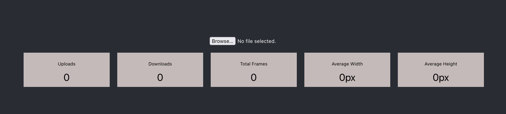

# Data Engineer Assignment

To see how you work and think, we will do a little programming today. We will
focus on:

1. If you can produce quality work in a timely manner
2. Your knowledge of several concepts in micro services and API's
3. Basic data modelling skills
4. (Bonus) Kubernetes experience

For this exercise you will **NOT** be judged on:

1. Code repo management (quality of commit messages, PR names, branch names, and
   all that). You can even hack it in a dropbox folder if that’s your thing.
2. Over-documenting. We prefer you write clear code, and that should not require
   a lot of documentation. Don’t write more docs than you normally would.
3. Web design (colors, spacing, etc)
4. Form validation

## Preliminaries

You've

- Installed `nvm` so you can install node versions
- Installed `docker`
- Created a private GitHub repository where you've added us as collaborators

### The assignment

Your task is to build a simple frontend web app and an API in a framework of your choice. This web app should be able to transform GIF's into individual PNG slices and return a ZIP file to the user. The API behind it will also store additional file metadata in a database that is shown on the front-end.

### Front-end

A sample Create React App front-end is provided in the [app](app/) folder. A user can do the following.

- Upload a new file
- Get the individual slices as a ZIP file within 30 seconds
- A dashboard shows
  - Global total uploads
  - Global total downloads
  - Global total frames uploaded
  - Global average width of the GIFs
  - Global average height of the GIFs
- (Bonus) Return a shareable URL instead that can be used by anyone

The front-end requires you to update the URLs to point to your implemented back-end.

### Back-end

The back-end must be implemented by you in a language/framework of your choice. The requirements are.

- A POST endpoint `/api/upload` that can accept a GIF as form data
- A GET endpoint `/api/meta` to query for metadata
- Transform the GIF by placing the individual frames as PNG's in a ZIP file

### For bonus:

You might have some time left, in that case we would like to see:

- Some unit tests to prove the steps work as expected
- Implement user management + authentication
- Brush up the front-end
- Deploying this to your (localhost) Kubernetes cluster
- Provide other transformations, such as
  - Increase the framerate of the GIF as an extra option
  - Reverse the GIF
  - Any other fun changes of your choice

